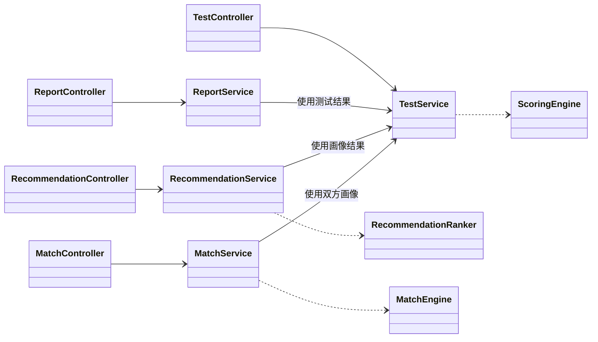
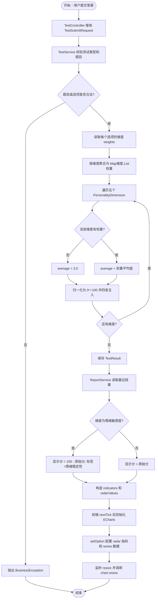

# 性格雷达·生活指南软件设计报告

## 3.4 子系统/构件设计

### 3.4.1 总体构件划分

系统采用前后端分离和分层设计。前端负责测试交互、报告展示、推荐反馈和双人适配可视化；后端按照“控制器层、业务服务层、算法构件层、数据访问层、领域模型层”组织代码。

| 层次 | 主要构件 | 主要职责 |
| --- | --- | --- |
| 前端表现层 | `TestView`、`ReportView`、`RecommendationsView`、`MatchView` | 收集用户输入，展示测试进度、雷达图、推荐列表和适配报告 |
| 控制器层 | `TestController`、`ReportController`、`RecommendationController`、`MatchController` | 接收 REST 请求，校验请求对象，取得当前登录用户并调用业务服务 |
| 业务服务层 | `TestService`、`ReportService`、`RecommendationService`、`MatchService` | 编排题目读取、答案提交、报告生成、推荐反馈和适配报告持久化 |
| 算法构件层 | `ScoringEngine`、`RecommendationRanker`、`MatchEngine` | 完成分数归一化、标签加权排序和双人维度差异计算 |
| 数据访问层 | 各类 `Repository` | 通过 Spring Data JPA 访问 MySQL 数据库 |
| 领域模型层 | `Question`、`TestResult`、`RecommendationItem`、`Feedback`、`CompatibilityReport` 等 | 表达题库、画像、推荐、反馈和适配报告等核心业务数据 |

> 设计文档中的 `RecommendationEngine` 是“推荐引擎”逻辑构件名。当前代码没有同名 Java 类，其职责由 `RecommendationService`（流程编排、数据读取、反馈更新）和 `RecommendationRanker`（纯排序算法）共同实现。

### 3.4.2 测试与画像子系统

测试与画像子系统负责题目读取、答案合法性检查、维度权重聚合、百分制归一化和测试结果持久化。

主要构件如下：

| 构件 | 输入 | 输出 | 说明 |
| --- | --- | --- | --- |
| `QuestionController` | 测试类型 `String type` | `ApiResponse<List<QuestionResponse>>` | 按测试类型返回启用题目 |
| `TestController` | `TestSubmitRequest` | `ApiResponse<TestResultResponse>` | 提交答案或查询当前用户历史结果 |
| `TestService` | 当前用户、题目和选项 ID | `TestResultResponse` | 校验题目与选项归属并聚合维度权重 |
| `ScoringEngine` | `Map<String, List<Integer>>` | `Map<String, Integer>` | 将各维度 1～5 权重平均值归一化为 0～100 分 |
| `TestResultRepository` | `TestResult` | 持久化结果 | 保存每次测试的类型、维度分数和创建时间 |

该子系统的数据流为：

```text
前端答题
  -> TestController.submit(request)
  -> TestService.submit(user, request)
  -> 校验题目、测试类型、选项归属
  -> 聚合 QuestionOption.weights
  -> ScoringEngine.normalizeScores(rawWeights)
  -> 保存 TestResult
  -> 返回 TestResultResponse
```

### 3.4.3 报告与雷达图子系统

报告子系统读取当前用户最近一次基础性格测试结果，生成五维雷达图标准数据、维度解释和生活建议，并保存报告快照。

| 构件 | 职责 |
| --- | --- |
| `ReportController` | 提供当前报告、历史报告和指定快照查询接口 |
| `ReportService` | 读取最近结果，构造 `RadarIndicator`、`radarValues`、解释和建议 |
| `ReportSnapshotRepository` | 保存报告 JSON 快照，保证历史报告可复现 |
| `ReportView.draw()` | 使用 ECharts `radar` 系列实时渲染雷达图 |

后端保留 `NEUROTICISM`（情绪敏感度）原始分数；面向用户展示时将其转换为正向指标“情绪稳定性”：

```text
情绪稳定性 = 100 - 情绪敏感度
```

其他四个维度直接使用归一化后的百分制分数。每个雷达指标的最大值固定为 100。

### 3.4.4 个性化推荐子系统

推荐子系统根据推荐项基础分、推荐标签、管理员规则权重、用户历史反馈权重和性格维度信号计算最终推荐分，并按得分降序返回。

| 构件 | 职责 |
| --- | --- |
| `RecommendationController` | 提供按场景获取推荐和提交反馈的接口 |
| `RecommendationService` | 读取画像、推荐项、规则和用户偏好；保存反馈并更新偏好 |
| `RecommendationRanker` | 执行多维度性格到场景标签的映射与加权计算 |
| `RecommendationItemRepository` | 按场景读取启用的推荐项 |
| `RecommendationRuleRepository` | 读取管理员配置的全局标签权重 |
| `UserPreferenceRepository` | 保存用户级标签偏好，形成反馈闭环 |

当前推荐得分采用可解释的加法规则模型：

```text
推荐得分 S =
    baseScore
  + Σ userPreference(tag)
  + Σ globalRuleWeight(tag)
  + personalityAdjustment(tag)

最终得分 = clamp(S, 0, 100)
```

性格维度到标签的映射关系如下：

| 场景标签 | 对应维度 | 调整值 |
| --- | --- | ---: |
| `explore` 探索尝鲜 | `OPENNESS` 开放性 | `(开放性 - 50) / 5` |
| `structured` 计划稳定 | `CONSCIENTIOUSNESS` 尽责性 | `(尽责性 - 50) / 5` |
| `social` 社交表达 | `EXTRAVERSION` 外向性 | `(外向性 - 50) / 5` |
| `gentle` 舒缓恢复 | `AGREEABLENESS` 宜人性 | `(宜人性 - 50) / 5` |

如果维度不存在，则按中性值 50 处理；如果标签没有用户偏好或全局规则，则对应增量为 0。Java 整数除法使调整值保持整数。

用户反馈会改变推荐项所绑定标签的用户偏好权重：

| 反馈 | 标签权重增量 |
| --- | ---: |
| 喜欢 `LIKE` | `+8` |
| 一般 `NEUTRAL` | `+2` |
| 不喜欢 `DISLIKE` | `-8` |

单个用户标签权重限制在 `[-30, 30]`。下一次请求推荐列表时，新的偏好权重自动参与重新计算和排序。

### 3.4.5 双人适配子系统

双人适配子系统读取双方最近一次基础性格测试结果，以五个维度的平均绝对差计算契合度，并生成高相似维度、差异维度和相处建议。

| 构件 | 职责 |
| --- | --- |
| `MatchController` | 创建、查询和列出当前用户拥有的适配报告 |
| `MatchService` | 校验双方身份与测试数据，组织报告文本并持久化 |
| `MatchEngine` | 计算五维画像总体契合度 |
| `CompatibilityReportRepository` | 保存适配分数、摘要、优势、预警和建议 |

计算公式为：

```text
dimensionDiff(i) = abs(scoreA(i) - scoreB(i))
averageDiff = Σ dimensionDiff(i) / 5
compatibility = round1(max(0, 100 - averageDiff))
```

缺失维度使用中性值 50。差值最小的两个维度作为“高契合维度”，差值最大的两个维度作为“差异较大维度”。

### 3.4.6 核心构件协作关系



## 3.5 详细类设计

### 3.5.1 UML 标记说明

| 标记 | 含义 |
| --- | --- |
| `+` | `public`，可由其他类调用 |
| `-` | `private`，仅类内部可见 |
| `#` | `protected`，本项目核心类中未使用 |
| `{static}` | 静态方法，不依赖对象实例 |

### 3.5.2 `TestController`

职责：提供测试提交和历史记录查询 REST 接口，将当前登录用户和请求 DTO 交给 `TestService`。

| 可见性 | 方法名 | 参数 | 返回值 |
| --- | --- | --- | --- |
| `+` | `TestController` | `CurrentUserService currentUser, TestService testService` | 构造方法 |
| `+` | `submit` | `TestSubmitRequest request` | `ApiResponse<TestResultResponse>` |
| `+` | `history` | 无 | `ApiResponse<List<TestResultResponse>>` |

接口映射：

```text
POST /api/tests/submit -> submit(TestSubmitRequest)
GET  /api/tests/history -> history()
```

### 3.5.3 `TestService`

职责：执行测试类型解析、题目和选项合法性校验、维度权重聚合、结果保存和历史查询。

| 可见性 | 方法名 | 参数 | 返回值 |
| --- | --- | --- | --- |
| `+` | `TestService` | `QuestionRepository questions, QuestionOptionRepository options, TestResultRepository results` | 构造方法 |
| `+` | `listQuestions` | `String type` | `List<QuestionResponse>` |
| `+` | `submit` | `UserAccount user, TestSubmitRequest request` | `TestResultResponse` |
| `+` | `history` | `UserAccount user` | `List<TestResultResponse>` |
| `+` | `latestOrThrow` | `UserAccount user, TestType type` | `TestResult` |

关键约束：

- 请求中的每一道题必须存在，且题目类型必须与提交类型一致。
- 每个选项必须存在，并且属于当前题目。
- 维度原始值来自 `QuestionOption.weights`，因此反向语义通过题库选项权重配置体现。
- 方法使用事务保证结果保存的一致性。

### 3.5.4 `ScoringEngine`

职责：将各维度的 1～5 权重集合归一化为 0～100 分。

| 可见性 | 方法名 | 参数 | 返回值 |
| --- | --- | --- | --- |
| `-` | `ScoringEngine` | 无 | 私有构造方法 |
| `+ {static}` | `normalizeScores` | `Map<String, List<Integer>> rawWeights` | `Map<String, Integer>` |

单维度计算公式：

```text
average = 该维度所有选项权重的平均值
若无数据，则 average = 3.0
score = round(clamp((average - 1) / 4 × 100, 0, 100))
```

### 3.5.5 `RecommendationController`

职责：提供场景推荐列表和推荐反馈接口。

| 可见性 | 方法名 | 参数 | 返回值 |
| --- | --- | --- | --- |
| `+` | `RecommendationController` | `CurrentUserService currentUser, RecommendationService recommendationService` | 构造方法 |
| `+` | `list` | `String scene` | `ApiResponse<List<RecommendationResponse>>` |
| `+` | `feedback` | `Long id, FeedbackRequest request` | `ApiResponse<Void>` |

接口映射：

```text
GET  /api/recommendations?scene={scene} -> list(String)
POST /api/recommendations/{id}/feedback -> feedback(Long, FeedbackRequest)
```

### 3.5.6 `RecommendationEngine` 推荐引擎

`RecommendationEngine` 是推荐逻辑构件名，实际由下列两个类组成。

#### A. `RecommendationService`

| 可见性 | 方法名 | 参数 | 返回值 |
| --- | --- | --- | --- |
| `+` | `RecommendationService` | `RecommendationItemRepository items, TestResultRepository results, FeedbackRepository feedbacks, UserPreferenceRepository preferences, RecommendationRuleRepository rules` | 构造方法 |
| `+` | `recommend` | `UserAccount user, String sceneValue` | `List<RecommendationResponse>` |
| `+` | `feedback` | `UserAccount user, Long itemId, FeedbackRequest request` | `void` |

`recommend` 的内部步骤：

1. 将场景字符串转换为 `SceneType`。
2. 查询用户最近一次 `PERSONALITY` 测试结果。
3. 读取用户标签偏好和启用的全局推荐规则。
4. 读取当前场景下的启用推荐项。
5. 调用 `RecommendationRanker.score(...)` 计算每项得分。
6. 映射为 `RecommendationResponse`，按得分降序返回。

`feedback` 的内部步骤：

1. 校验推荐项是否存在。
2. 将请求中的评价转换为 `FeedbackRating`。
3. 保存反馈记录。
4. 根据评价计算 `+8`、`+2` 或 `-8` 的标签增量。
5. 更新推荐项所有标签对应的 `UserPreference`。
6. 将用户标签权重限制在 `[-30, 30]`。

#### B. `RecommendationRanker`

| 可见性 | 方法名 | 参数 | 返回值 |
| --- | --- | --- | --- |
| `-` | `RecommendationRanker` | 无 | 私有构造方法 |
| `+ {static}` | `score` | `int baseScore, List<String> tags, Map<String,Integer> preferences, Map<String,Integer> scores` | `int` |
| `+ {static}` | `score` | `int baseScore, List<String> tags, Map<String,Integer> preferences, Map<String,Integer> scores, Map<String,Integer> ruleWeights` | `int` |

四参数重载方法会使用空的全局规则映射，并转调五参数方法。五参数方法执行完整的标签加权和性格维度映射。

### 3.5.7 `MatchController`

职责：创建适配报告、查询当前用户的适配历史和指定报告。

| 可见性 | 方法名 | 参数 | 返回值 |
| --- | --- | --- | --- |
| `+` | `MatchController` | `CurrentUserService currentUser, MatchService matchService` | 构造方法 |
| `+` | `create` | `MatchRequest request` | `ApiResponse<MatchResponse>` |
| `+` | `list` | 无 | `ApiResponse<List<MatchResponse>>` |
| `+` | `get` | `Long id` | `ApiResponse<MatchResponse>` |

接口映射：

```text
POST /api/matches -> create(MatchRequest)
GET  /api/matches -> list()
GET  /api/matches/{id} -> get(Long)
```

### 3.5.8 `MatchService` 与 `MatchEngine`

#### A. `MatchService`

| 可见性 | 方法名 | 参数 | 返回值 |
| --- | --- | --- | --- |
| `+` | `MatchService` | `UserRepository users, TestResultRepository results, CompatibilityReportRepository reports` | 构造方法 |
| `+` | `create` | `UserAccount owner, MatchRequest request` | `MatchResponse` |
| `+` | `get` | `UserAccount owner, Long id` | `MatchResponse` |
| `+` | `list` | `UserAccount owner` | `List<MatchResponse>` |
| `-` | `toResponse` | `CompatibilityReport report` | `MatchResponse` |
| `-` | `split` | `String value` | `List<String>` |
| `-` | `strongest` | `Map<String,Integer> left, Map<String,Integer> right, boolean similar` | `List<String>` |

`create` 方法还负责校验好友存在、禁止与自己匹配、检查双方基础性格测试结果，并将算法结果保存为 `CompatibilityReport`。

#### B. `MatchEngine`

| 可见性 | 方法名 | 参数 | 返回值 |
| --- | --- | --- | --- |
| `-` | `MatchEngine` | 无 | 私有构造方法 |
| `+ {static}` | `compatibilityScore` | `Map<String,Integer> left, Map<String,Integer> right` | `double` |

### 3.5.9 `ReportController` 与 `ReportService`

#### A. `ReportController`

| 可见性 | 方法名 | 参数 | 返回值 |
| --- | --- | --- | --- |
| `+` | `ReportController` | `CurrentUserService currentUser, ReportService reportService` | 构造方法 |
| `+` | `me` | 无 | `ApiResponse<ReportResponse>` |
| `+` | `history` | 无 | `ApiResponse<List<ReportSnapshotResponse>>` |
| `+` | `get` | `Long id` | `ApiResponse<ReportSnapshotResponse>` |

#### B. `ReportService`

| 可见性 | 方法名 | 参数 | 返回值 |
| --- | --- | --- | --- |
| `+` | `ReportService` | `TestResultRepository results, ReportSnapshotRepository snapshots, ObjectMapper mapper` | 构造方法 |
| `+` | `reportFor` | `UserAccount user` | `ReportResponse` |
| `+` | `history` | `UserAccount user` | `List<ReportSnapshotResponse>` |
| `+` | `get` | `UserAccount user, Long id` | `ReportSnapshotResponse` |
| `-` | `buildReport` | `UserAccount user, TestResult result` | `ReportResponse` |
| `-` | `snapshotResponse` | `ReportSnapshot snapshot` | `ReportSnapshotResponse` |
| `-` | `interpretation` | `PersonalityDimension dimension, int score` | `String` |
| `-` | `displayScore` | `PersonalityDimension dimension, int score` | `int` |
| `-` | `displayLabel` | `PersonalityDimension dimension` | `String` |
| `-` | `prioritySuggestion` | `Map<String,Integer> scores` | `String` |

### 3.5.10 多维度性格—场景标签映射算法活动图

```mermaid
flowchart TD
    A([开始：请求某场景推荐]) --> B[读取最近一次基础性格结果]
    B --> C{是否存在画像}
    C -- 否 --> X[返回“请先完成基础性格测试”] --> Z([结束])
    C -- 是 --> D[读取推荐项、用户标签偏好、全局规则权重]
    D --> E[遍历当前场景的每个推荐项]
    E --> F[score = baseScore]
    F --> G[遍历推荐项 tags]
    G --> H[叠加 userPreference[tag] 与 ruleWeight[tag]]
    H --> I{标签类型}
    I -- explore --> I1[叠加 开放性调整值]
    I -- structured --> I2[叠加 尽责性调整值]
    I -- social --> I3[叠加 外向性调整值]
    I -- gentle --> I4[叠加 宜人性调整值]
    I -- 其他 --> I5[不增加性格调整]
    I1 --> J{还有标签?}
    I2 --> J
    I3 --> J
    I4 --> J
    I5 --> J
    J -- 是 --> G
    J -- 否 --> K[将得分限制在 0～100]
    K --> L{还有推荐项?}
    L -- 是 --> E
    L -- 否 --> M[按得分降序排序]
    M --> N[返回 RecommendationResponse 列表]
    N --> Z
```

### 3.5.11 雷达图实时生成计算活动图



### 3.5.12 设计特点

1. **职责分离**：控制器只处理 HTTP 边界，服务类负责编排，算法类保持无状态静态计算。
2. **可测试性**：`ScoringEngine`、`RecommendationRanker`、`MatchEngine` 不依赖 Spring 容器，可直接进行 JUnit 单元测试。
3. **可解释性**：推荐分数可以拆解为基础分、用户偏好、全局规则和性格维度调整，不使用不可解释的黑箱模型。
4. **隐私隔离**：报告和适配查询均通过当前登录用户限定数据范围，适配结果不返回对方完整答题内容。
5. **可扩展性**：新增标签时可在推荐规则和 `RecommendationRanker` 中增加映射；新增维度时可扩展 `PersonalityDimension` 和题目权重配置。

### 3.5.13 源码对应位置

| 内容 | 源码路径 |
| --- | --- |
| 测试控制器 | `backend/src/main/java/com/personality/radar/controller/TestController.java` |
| 推荐控制器 | `backend/src/main/java/com/personality/radar/controller/RecommendationController.java` |
| 适配控制器 | `backend/src/main/java/com/personality/radar/controller/MatchController.java` |
| 报告控制器 | `backend/src/main/java/com/personality/radar/controller/ReportController.java` |
| 测试业务与计分 | `backend/src/main/java/com/personality/radar/service/TestService.java`、`ScoringEngine.java` |
| 推荐引擎 | `backend/src/main/java/com/personality/radar/service/RecommendationService.java`、`RecommendationRanker.java` |
| 适配算法 | `backend/src/main/java/com/personality/radar/service/MatchService.java`、`MatchEngine.java` |
| 报告与雷达数据 | `backend/src/main/java/com/personality/radar/service/ReportService.java` |
| 前端雷达图渲染 | `frontend/src/views/ReportView.vue` |
